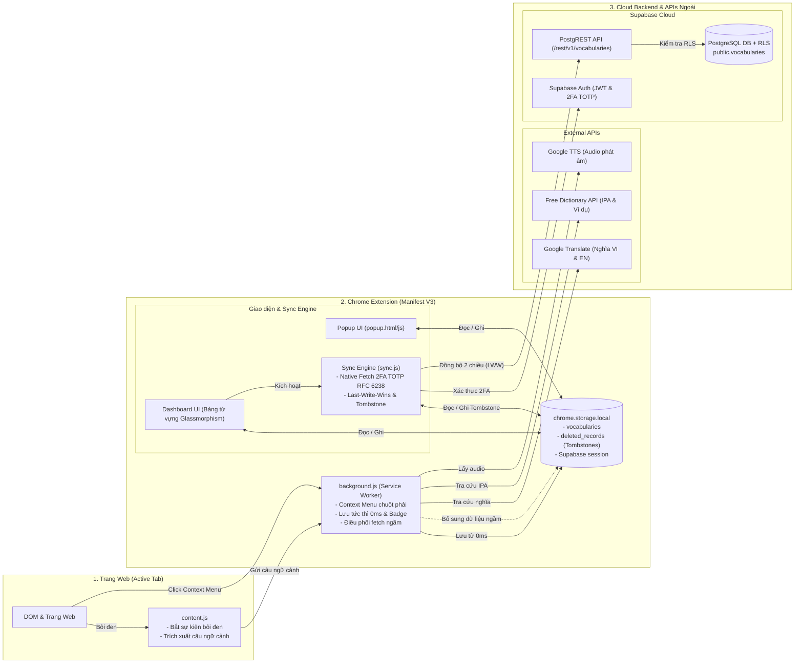

```mermaid
flowchart LR
    %% ================= 1. TRANG WEB & CLIENT =================
    subgraph Web["1. Trang Web (Active Tab)"]
        direction TB
        DOM["DOM & Trang Web"]
        CS["content.js<br/>- Bắt sự kiện bôi đen<br/>- Trích xuất câu ngữ cảnh"]
        DOM -->|"Bôi đen"| CS
    end

    %% ================= 2. CHROME EXTENSION =================
    subgraph Ext["2. Chrome Extension (Manifest V3)"]
        direction TB
        SW["background.js (Service Worker)<br/>- Context Menu chuột phải<br/>- Lưu tức thì 0ms & Badge<br/>- Điều phối fetch ngầm"]
        
        Storage[("chrome.storage.local<br/>- vocabularies<br/>- deleted_records (Tombstones)<br/>- Supabase session")]
        
        subgraph UI["Giao diện & Sync Engine"]
            direction TB
            Popup["Popup UI (popup.html/js)"]
            Dash["Dashboard UI (Bảng từ vựng Glassmorphism)"]
            Sync["Sync Engine (sync.js)<br/>- Native Fetch 2FA TOTP RFC 6238<br/>- Last-Write-Wins & Tombstone"]
        end

        SW -->|"Lưu từ 0ms"| Storage
        SW -.->|"Bổ sung dữ liệu ngầm"| Storage
        Popup <-->|"Đọc / Ghi"| Storage
        Dash <-->|"Đọc / Ghi"| Storage
        Sync <-->|"Đọc / Ghi Tombstone"| Storage
        Dash -->|"Kích hoạt"| Sync
    end

    %% ================= 3. DỊCH VỤ NGOÀI & BACKEND =================
    subgraph Cloud["3. Cloud Backend & APIs Ngoài"]
        direction TB
        subgraph APIs["External APIs"]
            GT["Google Translate (Nghĩa VI & EN)"]
            FD["Free Dictionary API (IPA & Ví dụ)"]
            TTS["Google TTS (Audio phát âm)"]
        end

        subgraph Supabase["Supabase Cloud"]
            Auth["Supabase Auth (JWT & 2FA TOTP)"]
            REST["PostgREST API (/rest/v1/vocabularies)"]
            DB[("PostgreSQL DB + RLS<br/>public.vocabularies")]
            REST -->|"Kiểm tra RLS"| DB
        end
    end

    %% ================= LIÊN KẾT GIỮA CÁC KHỐI =================
    DOM -->|"Click Context Menu"| SW
    CS -->|"Gửi câu ngữ cảnh"| SW

    SW -->|"Tra cứu nghĩa"| GT
    SW -->|"Tra cứu IPA"| FD
    SW -->|"Lấy audio"| TTS

    Sync -->|"Xác thực 2FA"| Auth
    Sync -->|"Đồng bộ 2 chiều (LWW)"| REST
```