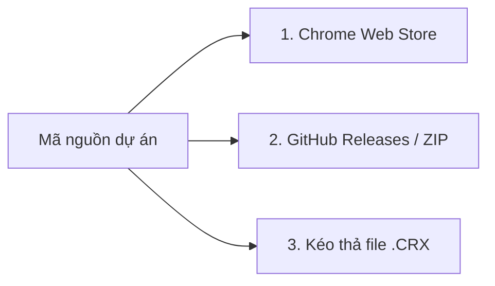

# 📦 Hướng Dẫn Đóng Gói & Phân Phối Extension

Tài liệu này hướng dẫn cách đóng gói extension sang định dạng chuẩn (`.crx`, `.zip`) và các cơ chế phân phối tiện ích đến người dùng trên hệ sinh thái Chromium (Chrome, Brave, Edge, Cốc Cốc).

---

## 1. Phân Biệt: Unpacked vs Packed Extension

* **Unpacked Extension (Tiện ích chưa đóng gói)**:
  - Cài đặt bằng cách nạp trực tiếp thư mục mã nguồn qua chế độ `Developer mode -> Load unpacked`.
  - Trình duyệt Chrome sẽ hiển thị biểu tượng màu cam và nhãn cảnh báo *"Unpacked extension"* để báo hiệu extension chưa được ký số chính thức.
* **Packed Extension (Tiện ích đã đóng gói - `.crx`)**:
  - Toàn bộ mã nguồn được nén và ký số bằng cặp khóa riêng tư/công khai (Private Key `.pem`).
  - Được phân phối qua Chrome Web Store hoặc cài đặt trực tiếp trên các trình duyệt hỗ trợ.

---

## 2. Cách Đóng Gói Thành File `.crx` Trực Tiếp Trên Trình Duyệt

1. Mở trình duyệt (Chrome hoặc Brave) và truy cập `chrome://extensions`.
2. Bật công tắc **Developer mode** ở góc trên bên phải.
3. Nhấp vào nút **Pack extension (Đóng gói tiện ích)**.
4. Điền các thông tin:
   * **Extension root directory**: Chọn đường dẫn thư mục gốc của dự án (`eng-extension`).
   * **Private key file**: 
     - **Lần đầu tiên**: Để trống -> Chrome sẽ tự sinh ra file khóa bí mật `.pem`.
     - **Các lần sau (cập nhật phiên bản)**: Chọn đúng file `.pem` đã sinh trước đó để Extension giữ nguyên ID (không bị mất dữ liệu local của người dùng).
5. Bấm **Pack extension**:
   * Hệ thống sẽ xuất ra 2 file nằm ở thư mục cha bên ngoài:
     - `eng-extension.crx` (file cài đặt tiện ích đã đóng gói).
     - `eng-extension.pem` (khóa bí mật ký số, cần cất giữ cẩn thận).

---

## 3. Các Cơ Chế Phân Phối (Distribution Channels)

### Phương án 1: Đưa lên Chrome Web Store (Khuyến nghị hàng đầu)
* **Đối tượng**: Phân phối chính thức, chuyên nghiệp, người dùng không cần bật Developer mode.
* **Chi phí**: 5$ USD một lần duy nhất cho tài khoản Google Developer.
* **Các chế độ phân phối trên Store**:
  * **Public**: Ai cũng tìm thấy và cài đặt được trên cửa hàng.
  * **Unlisted (Không công khai)**: Chỉ ai có link trực tiếp mới cài được (rất thích hợp chia sẻ bạn bè hoặc nhóm nội bộ mà không muốn công khai).
  * **Private (Nội bộ)**: Giới hạn danh sách email Google chỉ định.
* **Ưu điểm vượt trội**:
  - Không có biểu tượng cam "Unpacked".
  - Tự động cập nhật ngầm phiên bản mới khi lập trình viên release bản cập nhật.

### Phương án 2: Đóng gói ZIP chia sẻ qua GitHub Releases
* **Đối tượng**: Dự án mã nguồn mở, chia sẻ cho đồng nghiệp hoặc người dùng am hiểu công nghệ.
* **Cách thực hiện**:
  1. Nén các file cốt lõi của extension (`manifest.json`, `background.js`, `content.js`, `popup/`, `dashboard/`, `icons/`) thành file `english-vocab-hub.zip`.
  2. Tạo Release mới trên GitHub và đính kèm file `.zip`.
  3. Người dùng tải về -> Giải nén ra thư mục -> Mở `chrome://extensions` -> Bật *Developer mode* -> Nhấn *Load unpacked* trỏ vào thư mục đó.

### Phương án 3: Kéo thả file `.crx`
* **Trên Brave, Cốc Cốc, Edge**: Người dùng bật Developer mode, kéo thả file `.crx` vào trang tiện ích là cài được.
* **Trên Google Chrome chuẩn**: Chrome mặc định chặn cài `.crx` ngoài Web Store vì lý do an toàn, trừ khi được cấu hình qua Group Policy (GPO) doanh nghiệp.
