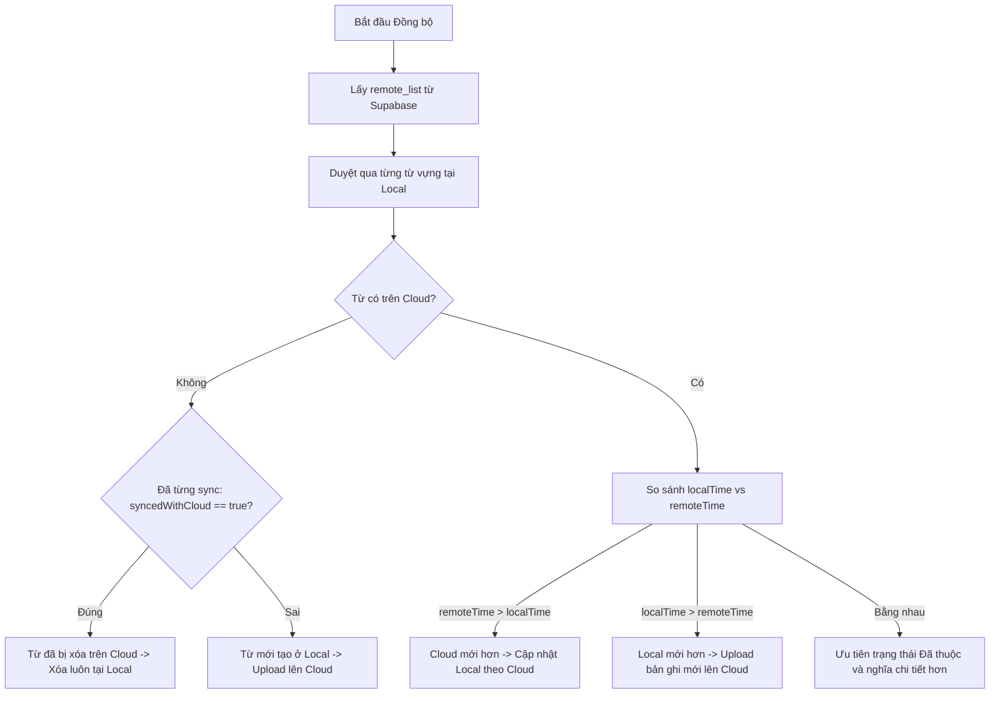

# 🔄 Kiến Trúc Đồng Bộ Đám Mây 2 Chiều (Two-Way Cloud Sync)

Tài liệu này mô tả chi tiết cơ chế đồng bộ dữ liệu giữa Extension (Local Storage) và Supabase Cloud (PostgreSQL), giải quyết triệt để các bài toán xung đột dữ liệu (Conflict Resolution) và xóa dữ liệu đa thiết bị (Multi-device Deletion).

---

## 1. Mô Hình 3 Trạng Thái Dữ Liệu

Hệ thống phân loại toàn bộ dữ liệu từ vựng theo 3 trạng thái rõ ràng:

| Trạng thái | Thuộc tính nhận diện | Biểu tượng UI | Mô tả |
| :--- | :--- | :---: | :--- |
| **1. Dữ liệu Cục bộ (Local Only)** | `syncedWithCloud: false` hoặc `undefined` | 🟡 `☁️↑` | Từ mới được lưu/thêm trên thiết bị hiện tại, chưa từng được đồng bộ lên Cloud. Khi bấm Sync, từ này được **Đồng bộ lên (Upload)**. |
| **2. Dữ liệu Đã đồng bộ (In-Sync / Sync Up)** | `syncedWithCloud: true` | 🟢 `☁️✓` | Từ vựng đã tồn tại trên cả Local và Cloud. Nếu có chỉnh sửa mới hơn tại máy này (`localTime > remoteTime`), từ này được **Đẩy cập nhật lên Cloud**. |
| **3. Dữ liệu Đồng bộ xuống (Sync Down)** | `syncedWithCloud: true` | 🟢 `☁️✓` | Từ mới được tạo hoặc sửa đổi trên thiết bị khác đã đồng bộ lên Cloud (`remoteTime > localTime`). Thiết bị hiện tại sẽ **Tải dữ liệu mới về**. |

---

## 2. Thuật Toán Giải Quyết Xung Đột (Last-Write-Wins - LWW)

Để đảm bảo dữ liệu giữa nhiều trình duyệt (Chrome, Brave, Edge...) không bị ghi đè dữ liệu cũ, hệ thống so sánh mốc thời gian sửa đổi gần nhất:

### Chi tiết so sánh mốc thời gian:
* **`localTime`**: Lấy từ `item.updatedAt` (hoặc fallback `lastReviewed`, `dateAdded`).
* **`remoteTime`**: Lấy từ cột `updated_at` trên bảng `public.vocabularies` (tự động cập nhật bởi PostgreSQL trigger `trigger_vocab_updated_at`).
* **Các điểm kích hoạt cập nhật `updatedAt` trên Client**:
  - Click đổi trạng thái từng từ (*Đang học ⇋ Đã thuộc*).
  - Đổi trạng thái hàng loạt (Batch Action).
  - Double-click sửa trực tiếp nghĩa/ví dụ (Inline Edit).
  - Form thêm/sửa từ trong Modal.
  - Sửa nghĩa nhanh trong Popup.
  - Chuột phải bôi đen lưu từ hoặc cập nhật câu ngữ cảnh từ `background.js`.

---

## 3. Cơ Chế Xóa 2 Chiều & Chống "Hồi Sinh" Dữ Liệu (Tombstone Pattern)

### Vấn đề thường gặp:
Nếu chỉ xóa phần tử trong `chrome.storage.local`:
1. Lần sync sau, Supabase vẫn còn bản ghi -> Trình duyệt tưởng là từ mới ở thiết bị khác và tự kéo về lại (hồi sinh từ đã xóa).
2. Nếu máy A xóa trên Cloud, máy B vẫn còn giữ từ đó ở Local -> Khi máy B sync, máy B sẽ đẩy ngược từ đó lên Cloud lại.

### Giải pháp triệt để đã triển khai:

1. **Xóa trực tiếp trên Cloud khi có kết nối mạng**:
   - Khi bấm Xóa (đơn lẻ hoặc hàng loạt), extension gửi ngay request `DELETE /rest/v1/vocabularies?id=in.(...)` lên Supabase để gỡ bỏ bản ghi ngay lập tức.
2. **Hàng đợi Tombstone (`deleted_records`)**:
   - Lưu vết danh sách `{ id, word, deletedAt }` vào `chrome.storage.local`.
   - Khi chạy `sync()`:
     - Tự động gọi `DELETE` lên Cloud cho toàn bộ các tombstone tồn đọng (phòng trường hợp lúc bấm xóa bị mất mạng).
     - Bộ lọc tải về từ Cloud **lọc bỏ toàn bộ** các từ trong Tombstone, không cho phép tải lại vào bảng.
3. **Đồng bộ xóa từ Cloud xuống Local**:
   - Khi một từ có cờ `syncedWithCloud === true` tại Local nhưng Cloud trả về **không còn từ đó nữa** (do thiết bị khác đã xóa) -> Local tự động xóa từ đó, không đẩy ngược lên Cloud.

---

## 4. Bảo Mật Xác Thực & 2FA TOTP

* **Kiến trúc Zero-Dependency**: Toàn bộ logic Auth, Session refresh, và 2FA TOTP được cài đặt bằng native `fetch` (không cần cài thêm thư viện `@supabase/supabase-js` cồng kềnh, giữ extension siêu nhẹ).
* **Mã hóa 2 lớp (TOTP)**: Tích hợp chuẩn RFC 6238, hỗ trợ Google Authenticator, Microsoft Authenticator, Authy.
* **Row Level Security (RLS)**: Mọi thao tác `SELECT`, `INSERT`, `UPDATE`, `DELETE` đều được kiểm tra điều kiện `auth.uid() = user_id`. Người dùng này hoàn toàn không thể đọc hoặc chỉnh sửa dữ liệu của người dùng khác.
